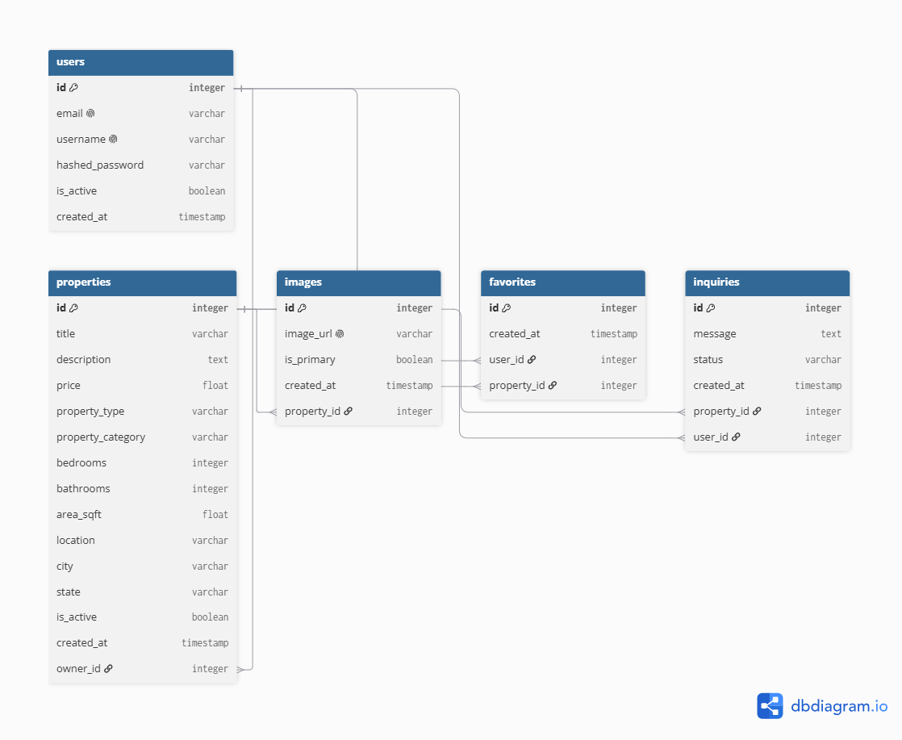
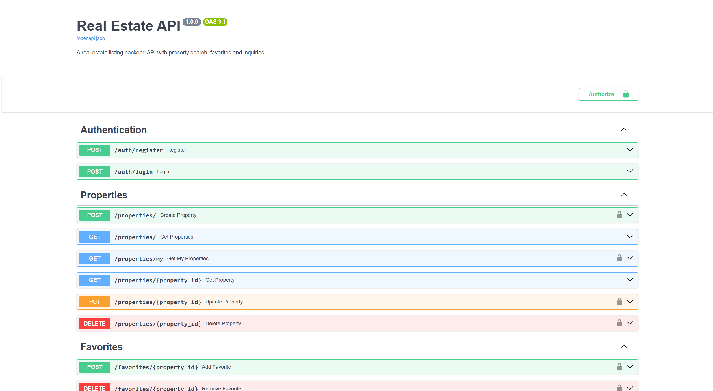

# 🏠 Real Estate Listing API

A real estate listing backend API with property search, favorites and inquiry system built with FastAPI and PostgreSQL.

---

## 🚀 What This Project Does

- Register and login securely
- List properties for sale or rent
- Browse and search properties publicly
- Filter by city, type, category, price range and bedrooms
- Save favorite properties
- Send inquiries to property owners
- Track inquiry status (pending/responded/closed)

---

## 🧠 What I Learned Building This

- Advanced filtering with multiple query parameters
- Price range filtering
- Favorites/wishlist system
- Inquiry management system
- Public vs protected endpoints
- Real-world real estate data modeling

---

## 🛠️ Tech Stack

| Technology | Purpose |
|------------|---------|
| Python 3.14 | Programming language |
| FastAPI | Web framework |
| PostgreSQL | Database |
| SQLAlchemy | ORM |
| Alembic | Migrations |
| PyJWT | Authentication |
| bcrypt | Password hashing |
| Docker | Containerization |
| Uvicorn | Server |

---

## ⚙️ How To Run

### Without Docker:
```bash
git clone https://github.com/sivamani151dev-cell/real-estate-api.git
cd real-estate-api
python -m venv venv
venv\Scripts\activate
pip install -r requirements.txt
python -m alembic upgrade head
uvicorn app.main:app --reload
```

### With Docker:
```bash
docker-compose up --build
```

---

## 📡 API Endpoints

### Authentication
| Method | Endpoint | Description | Auth |
|--------|----------|-------------|------|
| POST | `/auth/register` | Register | ❌ |
| POST | `/auth/login` | Login | ❌ |

### Properties
| Method | Endpoint | Description | Auth |
|--------|----------|-------------|------|
| POST | `/properties/` | List property | ✅ |
| GET | `/properties/` | Browse all | ❌ |
| GET | `/properties/my` | My listings | ✅ |
| GET | `/properties/{id}` | Get property | ❌ |
| PUT | `/properties/{id}` | Update listing | ✅ |
| DELETE | `/properties/{id}` | Delete listing | ✅ |

### Filters for GET /properties/
| Parameter | Type | Example |
|-----------|------|---------|
| city | string | ?city=Bangalore |
| property_type | enum | ?property_type=sale |
| property_category | enum | ?property_category=apartment |
| min_price | float | ?min_price=5000000 |
| max_price | float | ?max_price=10000000 |
| min_bedrooms | int | ?min_bedrooms=3 |

### Favorites
| Method | Endpoint | Description | Auth |
|--------|----------|-------------|------|
| POST | `/favorites/{id}` | Save property | ✅ |
| GET | `/favorites/` | My saved properties | ✅ |
| DELETE | `/favorites/{id}` | Remove from saved | ✅ |

### Inquiries
| Method | Endpoint | Description | Auth |
|--------|----------|-------------|------|
| POST | `/inquiries/{id}` | Send inquiry | ✅ |
| GET | `/inquiries/my` | My sent inquiries | ✅ |
| GET | `/inquiries/received` | Received inquiries | ✅ |
| PUT | `/inquiries/{id}` | Update status | ✅ |

---

## 📊 Database Schema



---

## 📸 Screenshots



---

## 🎯 Project Type
Portfolio Project — built to demonstrate real-world real estate platform capabilities.